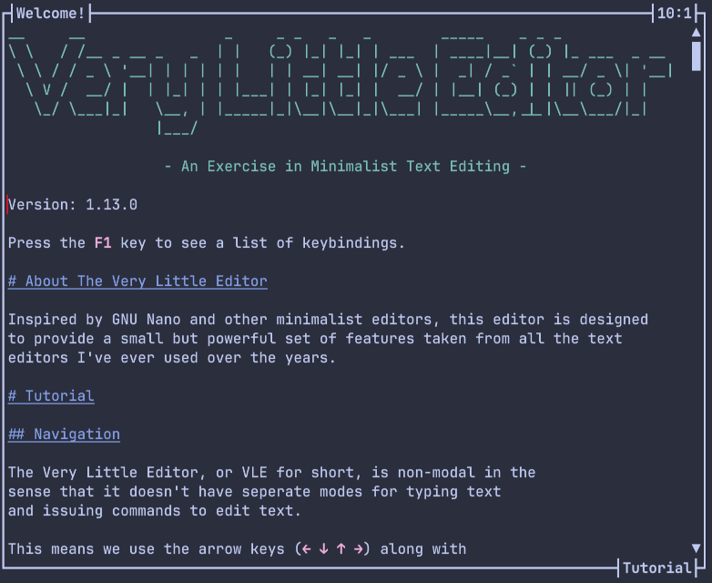
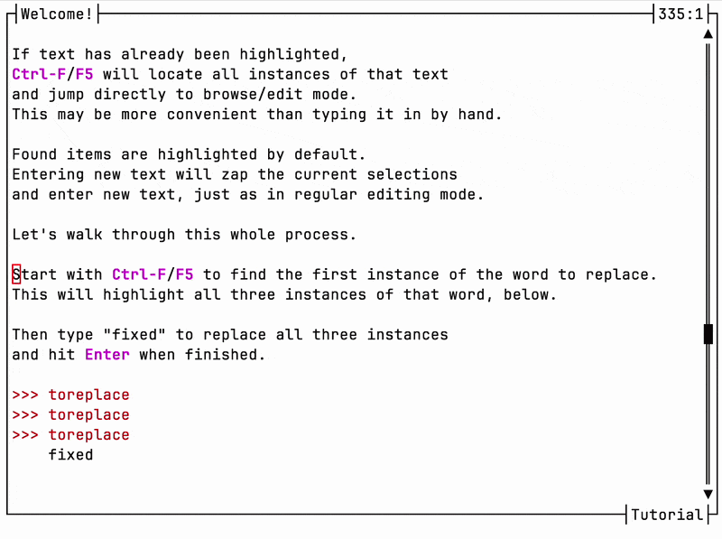
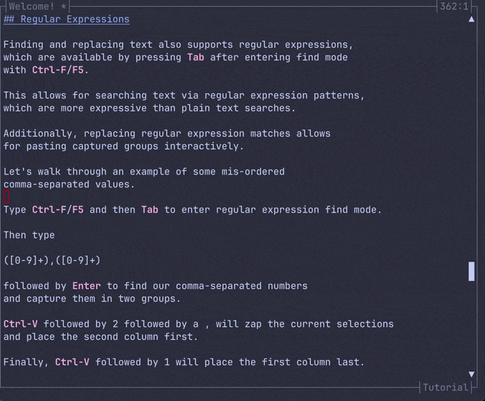
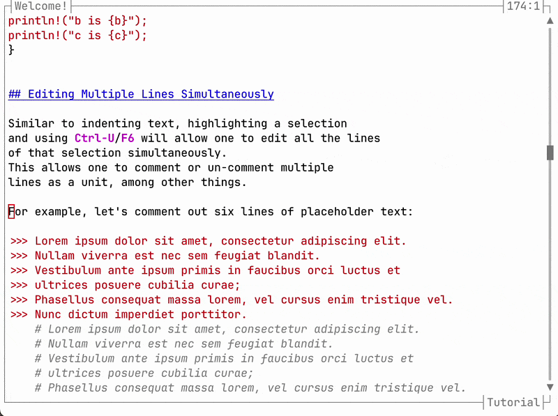
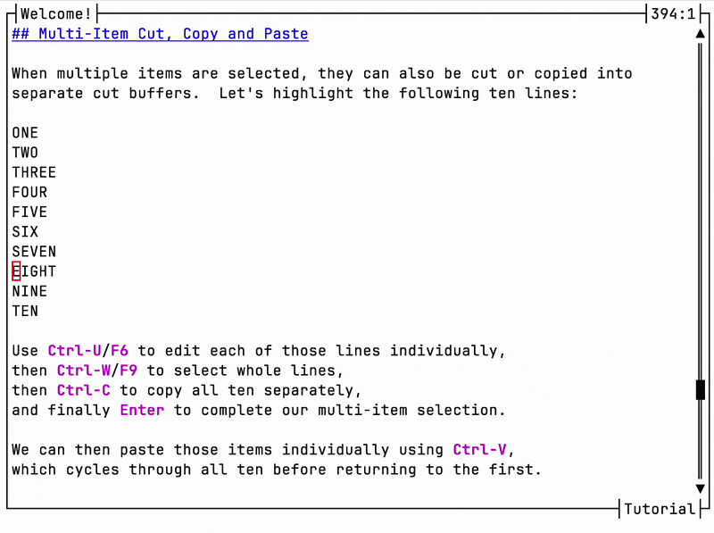
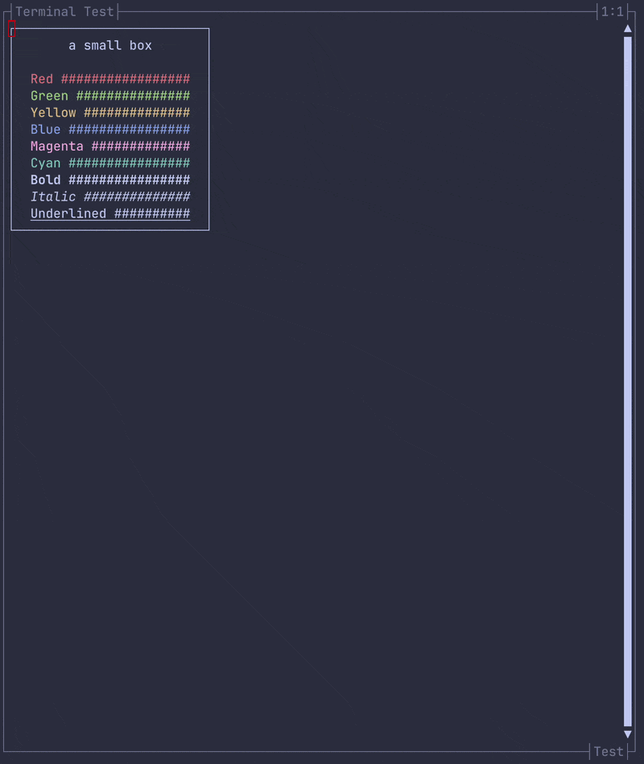

# Very Little Editor

The Very Little Editor, or VLE, is a small text editor
with just enough features to do some actual work.

Modern full-featured text editors can be a little daunting,
complete with dozens upon dozens of different commands
to remember and modes to switch between.
It's a lot of power, but that power comes with the cognative load
of having to remember which key combination to use or what
mode the editor is in at any given time.

Let's try a different approach and see just how *few* features we need.
By restricting our feature set to less than twenty powerful features,
we can devote more mental effort to our projects and less mental
effort to our tools.



# Installation

Installing VLE from source can be done using Cargo:

```bash
cargo install vle
```

VLE compiles to a single self-contained binary which contains everything.
Its syntax highlighting for different languages are built-in
and it uses no configuration file; its minimal configuration options
are done via simple environment variables.

# Keybindings

| Action                         | Shortcut       | Shortcut                           |
|-------------------------------:|----------------|------------------------------------|
| Toggle Keybindings Display     | <kbd>F1</kbd>  |                                    |
| Open File                      | <kbd>F2</kbd>  | <kbd>Ctrl</kbd>-<kbd>O</kbd>       |
| Save File                      | <kbd>F3</kbd>  | <kbd>Ctrl</kbd>-<kbd>S</kbd>       |
| Goto Line or Bookmark          | <kbd>F4</kbd>  | <kbd>Ctrl</kbd>-<kbd>T</kbd>       |
| Find Text in File or Selection | <kbd>F5</kbd>  | <kbd>Ctrl</kbd>-<kbd>F</kbd>       |
| Update Selected Lines          | <kbd>F6</kbd>  | <kbd>Ctrl</kbd>-<kbd>U</kbd>       |
| Goto Matching Pair             | <kbd>F7</kbd>  | <kbd>Ctrl</kbd>-<kbd>P</kbd>       |
| Select Inside Pair             | <kbd>F8</kbd>  | <kbd>Ctrl</kbd>-<kbd>E</kbd>       |
| Select Word or Whole Lines     | <kbd>F9</kbd>  | <kbd>Ctrl</kbd>-<kbd>W</kbd>       |
| Handle Pane Splits             | <kbd>F10</kbd> | <kbd>Ctrl</kbd>-<kbd>N</kbd>       |
| Reload File                    | <kbd>F11</kbd> | <kbd>Ctrl</kbd>-<kbd>L</kbd>       |
| Quit File                      | <kbd>F12</kbd> | <kbd>Ctrl</kbd>-<kbd>Q</kbd>       |
| Toggle Bookmark                | <kbd>Ins</kbd> | <kbd>Ctrl</kbd>-<kbd>B</kbd>       |
| Highlight Text                 |                | <kbd>Shift</kbd>-<kbd>Arrows</kbd> |
| Set Mark                       |                | <kbd>Ctrl</kbd>-<kbd>Space</kbd>   |
| Start of Selection             |                | <kbd>Ctrl</kbd>-<kbd>Home</kbd>    |
| End of Selection               |                | <kbd>Ctrl</kbd>-<kbd>End</kbd>     |
| Indent or Autocomplete         |                | <kbd>Tab</kbd>                     |
| Cut                            |                | <kbd>Ctrl</kbd>-<kbd>X</kbd>       |
| Copy                           |                | <kbd>Ctrl</kbd>-<kbd>C</kbd>       |
| Paste                          |                | <kbd>Ctrl</kbd>-<kbd>V</kbd>       |
| Undo                           |                | <kbd>Ctrl</kbd>-<kbd>Z</kbd>       |
| Redo                           |                | <kbd>Ctrl</kbd>-<kbd>Y</kbd>       |
| Switch Pane                    |                | <kbd>Ctrl</kbd>-<kbd>Arrows</kbd>  |
| Previous Buffer                |                | <kbd>Ctrl</kbd>-<kbd>PgUp</kbd>    |
| Next Buffer                    |                | <kbd>Ctrl</kbd>-<kbd>PgDn</kbd>    |
| Manage Buffers                 |                | <kbd>Ctrl</kbd>-<kbd>]</kbd>       |

Because we have so few features, non-navigational features
have alternative <kbd>Ctrl</kbd>-based and <kbd>F</kbd>-based keybindings.
This also helps maintain compatibility with terminal multiplexers
which have many of their own dedicated <kbd>Ctrl</kbd> bindings.

# Key Features

## Multi Cursor-Style Find and Replace

<kbd>Ctrl</kbd>-<kbd>F</kbd> / <kbd>F5</kbd> to find text will highlight
all matches and move your cursor to the next available match, if any.
Matches can be cycled between using the up and down arrow keys.
This much is unremarkable.

However, you may also *edit* found matches simply by
typing in new text, which overwrites the located matches,
or by using the left and right arrow keys to reposition cursors
within all matches to make partial edits.



Additionally, for regular-expression based searches,
captured groups can be pasted to all matches simultaneously.



## Multi Cursor-Style Line Editing

Similar to find-and-replace, you can simply highlight a selection of
lines and use <kbd>Ctrl</kbd>-<kbd>U</kbd> / <kbd>F6</kbd> to edit
each of them simultaneously as a unit.



## Multi Cursor-Style Copy and Paste

When multiple items are selected, they can also be cut/copied as a unit.
They can then be pasted individually, in order, or pasted as a unit
to another multi-item selection.



## Bookmarks

Have a spot in your file you'd like to mark and return to later?
Place bookmarks with <kbd>Ctrl</kbd>-<kbd>B</kbd> / <kbd>Insert</kbd>,
which drops visible positions in the text that remain fixed in place.
<kbd>Ctrl</kbd>-<kbd>T</kbd> / <kbd>F4</kbd> doubles as
both a way to jump to a specific line and also a means to
cycle between bookmarks using the arrow keys.

Bookmarks can be removed either by
<kbd>Ctrl</kbd>-<kbd>B</kbd> / <kbd>Insert</kbd> on the same position,
or simply by erasing the text containing the bookmark.
Hando for TODO items which are no longer needed.

## Split Pane Views

The editor's viewport can be split into vertical or horizontal panes
using <kbd>Ctrl</kbd>-<kbd>N</kbd> / <kbd>F10</kbd>.
Each pane can contain a different file, or different spots within the same file.
Switch between them using <kbd>Ctrl</kbd>-<kbd>Arrows</kbd>.
<kbd>Ctrl</kbd>-<kbd>N</kbd> / <kbd>F10</kbd> can split panes
recursively into more sub-panes, delete existing panes, or adjust
the pane size ratios.



# Configuration

With very little to configure, VLE doesn't use a config file at all.
Any configuration is performed with a modest number of environmental variables:

| Variable             | Default | Meaning                                  |
|----------------------|---------|------------------------------------------|
| `VLE_SPACES_PER_TAB` | 4       | number of spaces to output per tab       |
| `VLE_ALWAYS_TAB`     | 0       | whether to always insert literal tabs    |
| `VLE_PAGE_SIZE`      | 25      | number of lines PgUp and PgDn move       |
| `VLE_EXT_MAP`        | empty   | syntax highlighting extension mapping    |

No config file means there's one less thing to install,
learn the format of, modify or break.

## Extension Mapping

Syntax highlighting is determined by a file's extension.
If you have files with some non-standard extension,
the `VLE_EXT_MAP` environmental variable can map them
from one to another. Its syntax is a comma-separated list
of `src=target` key-value pairs. For example, if one has
a `file.tpl` that's should be highlighted as HTML, try:

```bash
VLE_EXT_MAP=tpl=html vle file.tpl
```

## ZelliJ and tmux Integration

When <kbd>Ctrl</kbd>-<kbd>Arrows</kbd> are used to navigate panes,
VLE normally stops when it cannot proceed further in any direction.
When running under [ZelliJ](https://zellij.dev/) or
[tmux](https://github.com/tmux/tmux), the editor will
issue a `zellij` or `tmux` command to change focus out of the
VLE's pane in the given direction.

Furthermore, the Fish's keybindings can be updated to also
use <kbd>Ctrl</kbd>-<kbd>Arrows</kbd> to navigate ZelliJ or tmux.
Simply add the corresponding bindings to your `~/.config/fish/config.fish`
file:

```
if set -q ZELLIJ
    bind ctrl-left "zellij action move-focus left"
    bind ctrl-right "zellij action move-focus right"
    bind ctrl-up "zellij action move-focus up"
    bind ctrl-down "zellij action move-focus down"
else if set -q TMUX
    bind ctrl-left "tmux select-pane -L"
    bind ctrl-right "tmux select-pane -R"
    bind ctrl-up "tmux select-pane -U"
    bind ctrl-down "tmux select-pane -D"
end
```

This allows one to navigate from the editor to a nearby shell,
and the reverse, for a seamless integration between the two.

# Why Another Editor?

I've tried *a lot* of different text editors over the years,
all with their own strengths and weaknesses.
But I could never find the exact text editor I was looking for.
Some were a little too overcomplicated.
Some were a little too primitive.
So rather than continue a seemingly endless search
for the exact right text editor for me, I decided to write my own
by mixing necessary features (like file saving) and those
that impressed me in other editors (like splitting panes
or selecting inside quotes).

Whether it's the editor for you depends on your needs and tastes.
But VLE has been developed exclusively with itself since version 0.2,
so I can confidently say that it's good enough for projects
at least as large as itself.
